# WDS Viewer — User Guide

A visual guide to all features in the WDS Viewer application.

> **Regenerate screenshots:** `pnpm screenshots` (requires imported data + built viewer)

---

## Table of Contents

1. [Home — Model Selection](#home--model-selection)
2. [Header & Navigation](#header--navigation)
3. [Tree Navigation](#tree-navigation)
4. [Diagram Viewer](#diagram-viewer)
5. [Info Pages](#info-pages)
6. [Search](#search)
7. [History](#history)
8. [Favorites](#favorites)
9. [Collections](#collections)
10. [Settings & Dark Mode](#settings--dark-mode)
11. [Keyboard Shortcuts](#keyboard-shortcuts)

---

## Home — Model Selection

When you open the application, you see a grid of available BMW vehicle models. Click any model card to start exploring its wiring diagrams and technical documentation.

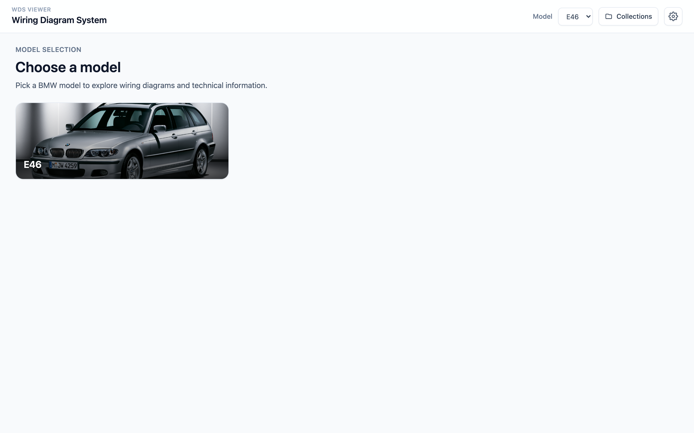

<details>
<summary>Dark mode</summary>

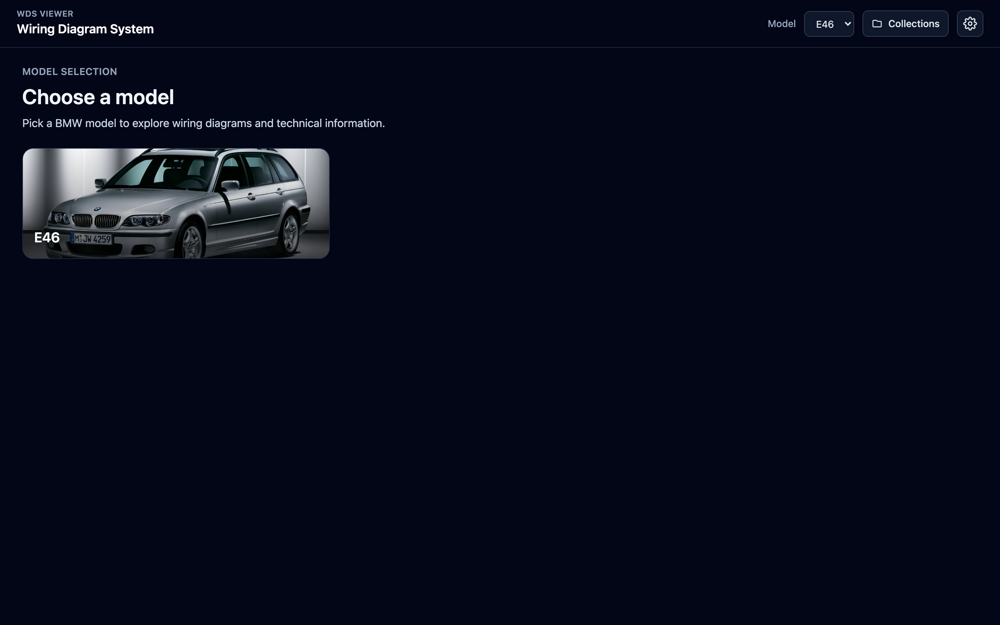

</details>

---

## Header & Navigation

The header bar provides quick access to all navigation features: model selector dropdown, history, favorites, collections, and settings.


| Element | Purpose |
|---------|---------|
| **WDS Viewer** logo | Return to model selection |
| **Model** dropdown | Switch between vehicle models |
| **History** button | Recently viewed items |
| **Favorites** button | Bookmarked items |
| **Collections** button | Organized item groups |
| **Settings** button | Theme and preferences |

---

## Tree Navigation

Each model has a hierarchical navigation tree. Expand folders to browse diagrams and info pages organized by system (e.g., engine, chassis, body).

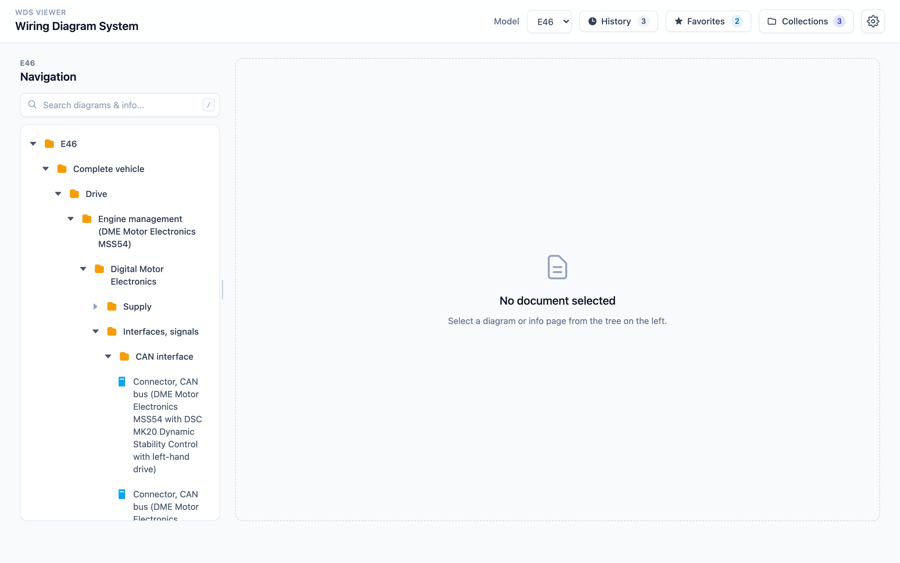

- Click a folder to expand/collapse
- Click a leaf node to open a diagram or info page
- The tree panel is resizable — drag the divider to adjust width

---

## Diagram Viewer

SVG wiring diagrams render with full pan & zoom support powered by `panzoom`.

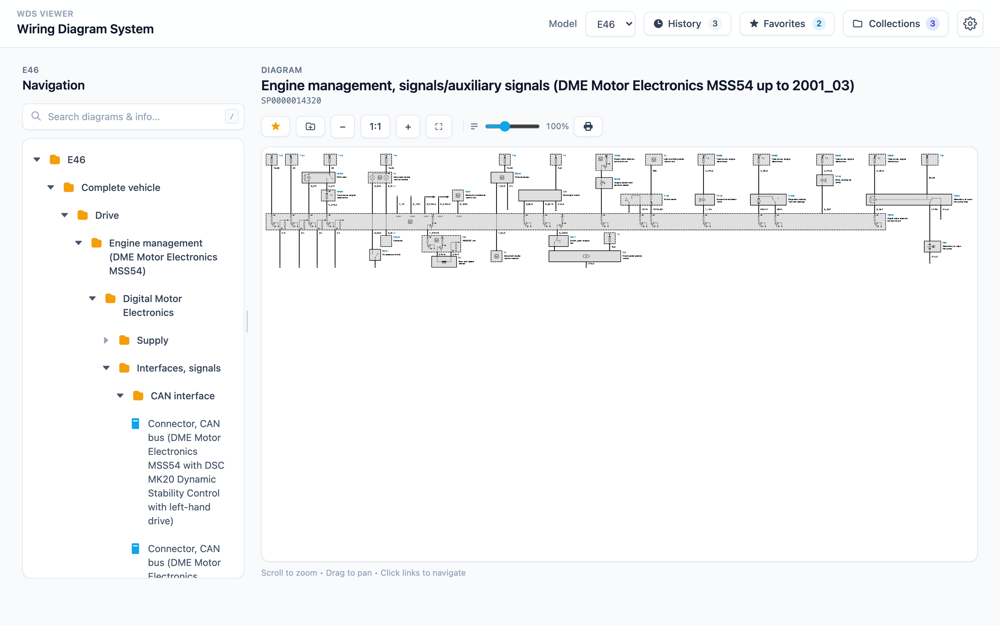

**Controls:**
- **Mouse wheel** — zoom in/out
- **Click + drag** — pan around the diagram
- **Clickable links** — navigate to related diagrams or trigger searches
- **Label scaling** — text size adjusts independently of zoom level (configurable in settings)
- **Print** — use `Ctrl+P` for an optimized print layout

---

## Info Pages

Technical documentation pages render from Markdown with full image support.

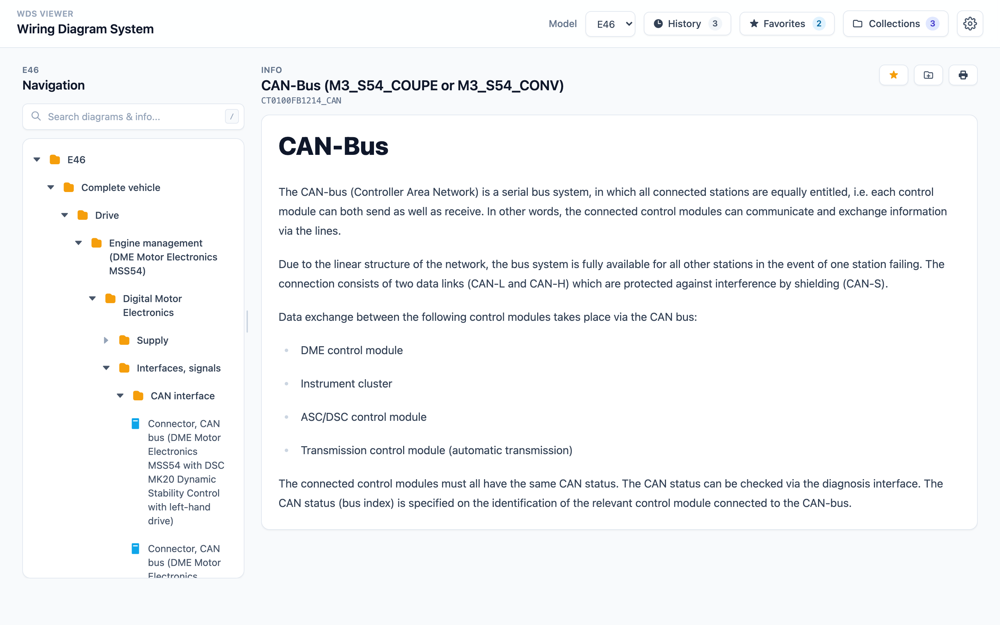

**Features:**
- **Image magnifier** — hold `Alt` and hover over any image to zoom (5x magnification, 300px lens)
- **Section navigation** — jump to headings via the sidebar
- **Related diagrams** — quick links to referenced wiring schematics

---

## Search

Press `/` or `Ctrl+K` to activate global search. Find diagrams and info pages by name instantly.

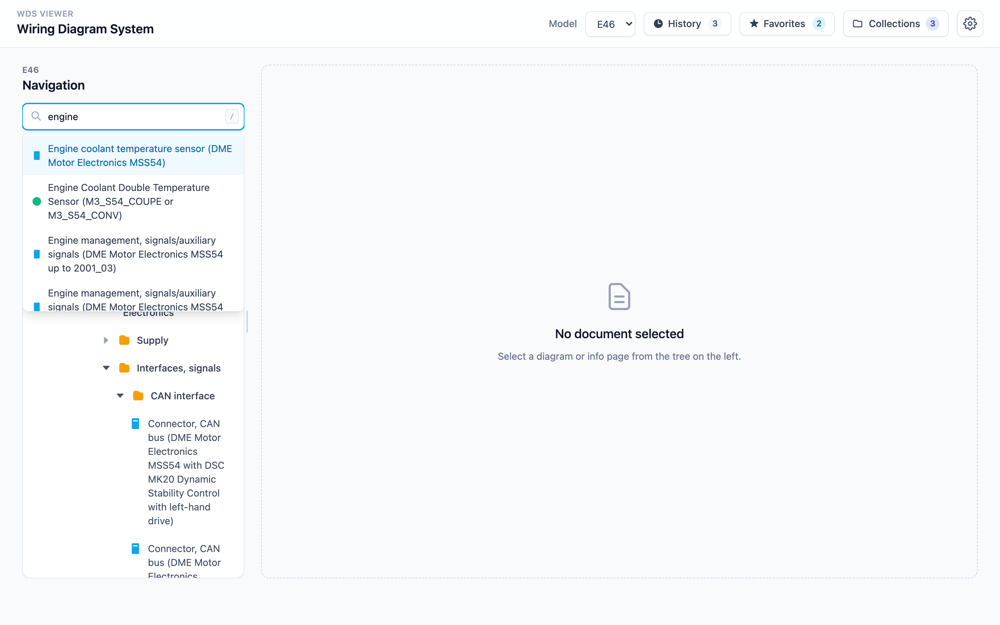

- Results update as you type
- Press `Enter` to navigate to the top result
- Press `Escape` to close search

---

## History

Quick access to recently viewed diagrams and info pages.

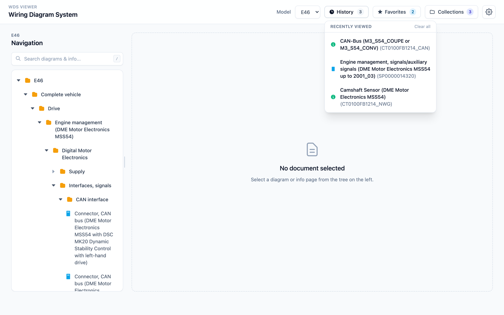

- Automatically tracks your navigation
- Click any item to revisit it

---

## Favorites

Bookmark frequently used diagrams and info pages for quick access.

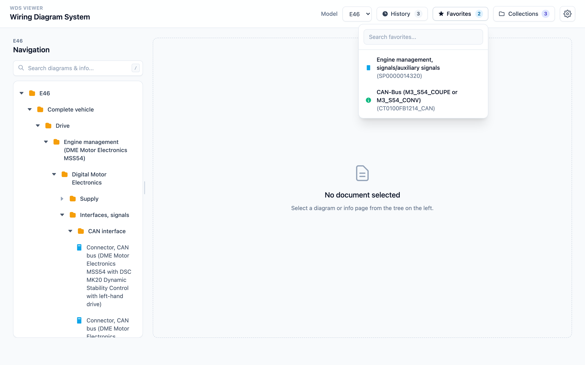

- Click the star icon on any diagram or info page to add it
- Access all bookmarks from the header dropdown

---

## Collections

Organize items into named groups for project-based workflows.

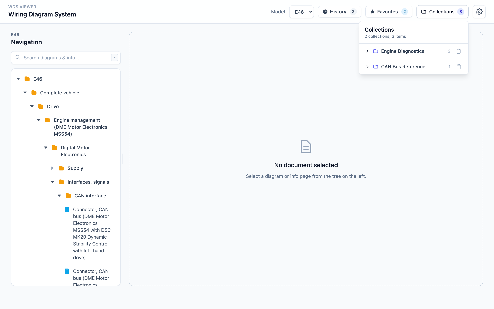

- Create named collections (e.g., "E46 Electrical Issues")
- Add diagrams and info pages to any collection
- Collections persist in browser local storage

---

## Settings & Dark Mode

Configure the viewer to your preferences.

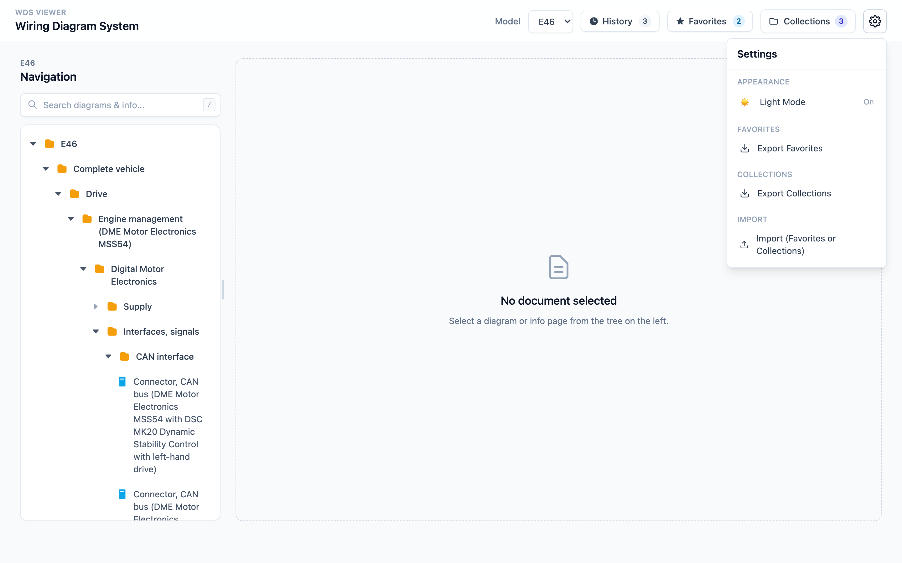

**Available settings:**
- **Dark mode** — toggle between light and dark themes (respects system preference by default)
- **Label scaling** — adjust diagram text size

### Dark Mode

The entire UI adapts to a dark color scheme.

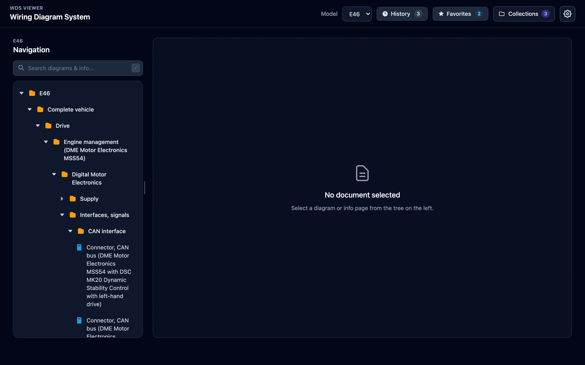

---

## Keyboard Shortcuts

| Key | Action |
|-----|--------|
| `/` or `Ctrl+K` | Focus search |
| `Escape` | Close search / clear selection |
| `Alt + hover` | Activate image magnifier (info pages) |

---

## Running Screenshots

To regenerate all screenshots:

```bash
# 1. Import data (if not already done)
pnpm import:run

# 2. Build the viewer
pnpm build

# 3. Capture screenshots
pnpm screenshots
```

Screenshots are saved to `docs/screenshots/light/` and `docs/screenshots/dark/`.
